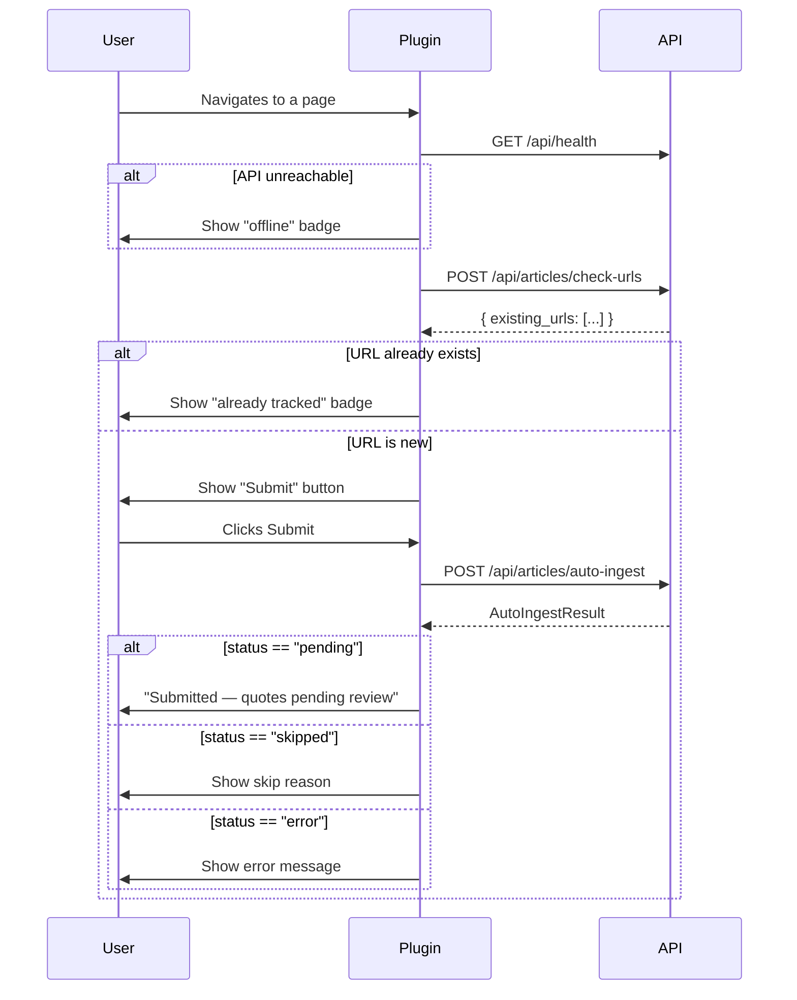

# Chrome Plugin — Article Submission API Spec

> **Version:** 1.0  
> **Last updated:** 2026-04-10  
> **Audience:** Chrome plugin developers (external project)

This document is the complete contract for building a Chrome extension that submits articles to the StatementTracking API. The server handles all heavy lifting — fetching page content, extracting quotes via LLM, resolving speakers, and persisting data. The plugin only needs to send a URL.

---

## Table of Contents

1. [Base URL & Deployment](#base-url--deployment)
2. [Authentication](#authentication)
3. [Recommended Plugin Flow](#recommended-plugin-flow)
4. [Endpoints](#endpoints)
   - [Health Check](#1-health-check)
   - [Check Existing URLs](#2-check-existing-urls)
   - [Submit Article](#3-submit-article-primary)
5. [Supported URL Types](#supported-url-types)
6. [Error Handling](#error-handling)
7. [Timeouts & Rate Limiting](#timeouts--rate-limiting)
8. [Ingestion Source Conventions](#ingestion-source-conventions)

---

## Base URL & Deployment

The API is deployed on Vercel. All endpoints are relative to the deployment root.

```
Production:  https://<your-vercel-domain>
Local dev:   http://localhost:8000
```

All endpoints are prefixed with `/api`. Content-Type for all requests and responses is `application/json`.

---

## Authentication

**None.** The API currently has no authentication layer. CORS is configured to allow all origins (`*`), so the Chrome plugin can call the API directly from any page context without hitting CORS issues.

> If auth is added later (e.g. an API key), this section will be updated. Plan for a configurable `Authorization` header in your plugin settings UI.

---

## Recommended Plugin Flow



**Summary:**

1. On page load, fire a health check. If the API is down, show a disabled/offline state.
2. Check if the current page URL is already in the database. If so, badge the icon (e.g. a checkmark) and skip submission.
3. When the user clicks "Submit", call `auto-ingest` with the page URL. Show the result status.

---

## Endpoints

### 1. Health Check

Lightweight connectivity test. Use on plugin startup or before showing the submit UI.

```
GET /api/health
```

**Request:** No body, no query parameters.

**Response (200):**

```json
{
  "status": "ok"
}
```

If the server is unreachable, you'll get a network error (no HTTP response).

---

### 2. Check Existing URLs

Determine whether one or more URLs already have an article record in the database. Use this to badge the plugin icon or disable the submit button.

```
POST /api/articles/check-urls
```

#### Request Body

| Field | Type       | Required | Description                            |
|-------|------------|----------|----------------------------------------|
| `urls` | `string[]` | Yes      | List of URLs to check. Send one or many. |

**Example — single URL (typical plugin usage):**

```json
{
  "urls": ["https://example.com/article/ai-policy-2026"]
}
```

#### Response (200)

| Field           | Type       | Description                                        |
|-----------------|------------|----------------------------------------------------|
| `existing_urls` | `string[]` | The subset of submitted URLs that already exist in the database. Empty array if none match. |

**Example — URL not yet tracked:**

```json
{
  "existing_urls": []
}
```

**Example — URL already tracked:**

```json
{
  "existing_urls": ["https://example.com/article/ai-policy-2026"]
}
```

#### Logic

- Performs an exact match on the `url` column of the `articles` table.
- URL normalization (trailing slashes, query params, etc.) is **not** applied. Send the URL exactly as it appears in the browser address bar.

---

### 3. Submit Article (Primary)

The core endpoint. Sends a URL to the server, which then:

1. Checks if the URL already exists (skips if so).
2. Fetches the page content (supports HTML, YouTube transcripts, tweets, PDFs, etc.).
3. Extracts AI-related quotes using an LLM (Claude).
4. Resolves or creates speaker/person records.
5. Saves the article and quotes to the database with `review_status = "pending"`.

```
POST /api/articles/auto-ingest
```

#### Request Body

| Field                     | Type     | Required | Description                                                                                          |
|---------------------------|----------|----------|------------------------------------------------------------------------------------------------------|
| `url`                     | `string` | Yes      | The full URL of the article to ingest.                                                              |
| `ingestion_source`        | `string` | Yes      | Identifies the source system. Use `"chrome_plugin"` (see [conventions](#ingestion-source-conventions)). |
| `ingestion_source_detail` | `string` | No       | Optional freeform detail — e.g. the submitting user's identifier or the page title.                  |

**Example:**

```json
{
  "url": "https://www.nytimes.com/2026/04/09/technology/ai-regulation-senate.html",
  "ingestion_source": "chrome_plugin",
  "ingestion_source_detail": "Submitted by user@example.com"
}
```

#### Response (200)

The response always returns HTTP 200 with a JSON body. The `status` field indicates the outcome.

| Field             | Type                         | Description                                                                 |
|-------------------|------------------------------|-----------------------------------------------------------------------------|
| `status`          | `string`                     | One of `"pending"`, `"skipped"`, or `"error"`. See status table below.     |
| `saved_count`     | `integer`                    | Number of quotes saved. `0` if skipped or errored.                         |
| `extracted_count` | `integer`                    | Number of quotes the LLM extracted (before save). `0` if skipped or errored.|
| `error`           | `string \| null`             | Human-readable error or skip reason. `null` on success.                    |
| `article`         | `ArticleMetadata \| null`    | Metadata about the saved article. `null` if skipped or errored.            |

**`article` object (when present):**

| Field                     | Type            | Description                                         |
|---------------------------|-----------------|-----------------------------------------------------|
| `url`                     | `string`        | The canonical URL stored.                           |
| `title`                   | `string \| null`| Article title extracted from the page.              |
| `publication`             | `string \| null`| Publication name (e.g. "The New York Times").       |
| `published_date`          | `string \| null`| ISO date (`YYYY-MM-DD`) of publication, if found.   |
| `ingestion_source`        | `string \| null`| Echoes back the source you sent.                    |
| `ingestion_source_detail` | `string \| null`| Echoes back the detail you sent.                    |

#### Status Values

| `status`    | Meaning                                                                                     | Action for Plugin                         |
|-------------|---------------------------------------------------------------------------------------------|-------------------------------------------|
| `"pending"` | Article saved successfully. Quotes are awaiting human review.                                | Show success. Optionally display `saved_count`. |
| `"skipped"` | Article was **not** processed. Check `error` for the reason.                                 | Show the `error` message to the user.     |
| `"error"`   | A failure occurred during fetch or extraction. Check `error` for details.                    | Show the `error` message. User can retry. |

**Common skip reasons (in the `error` field):**

| `error` value                                      | Cause                                                      |
|----------------------------------------------------|-------------------------------------------------------------|
| `"Article URL already exists in the database."`    | URL was already ingested previously.                        |
| `"No AI-related quotes found in the article."`     | LLM processed the page but found no relevant quotes.        |

#### Example Responses

**Success (quotes extracted and saved):**

```json
{
  "status": "pending",
  "saved_count": 3,
  "extracted_count": 3,
  "error": null,
  "article": {
    "url": "https://www.nytimes.com/2026/04/09/technology/ai-regulation-senate.html",
    "title": "Senate Advances AI Regulation Framework",
    "publication": "The New York Times",
    "published_date": "2026-04-09",
    "ingestion_source": "chrome_plugin",
    "ingestion_source_detail": "Submitted by user@example.com"
  }
}
```

**Skipped (duplicate URL):**

```json
{
  "status": "skipped",
  "saved_count": 0,
  "extracted_count": 0,
  "error": "Article URL already exists in the database.",
  "article": null
}
```

**Skipped (no relevant quotes):**

```json
{
  "status": "skipped",
  "saved_count": 0,
  "extracted_count": 0,
  "error": "No AI-related quotes found in the article.",
  "article": null
}
```

**Error (fetch failure):**

```json
{
  "status": "error",
  "saved_count": 0,
  "extracted_count": 0,
  "error": "Failed to fetch article: 403 Forbidden",
  "article": null
}
```

**Error (LLM extraction failure):**

```json
{
  "status": "error",
  "saved_count": 0,
  "extracted_count": 0,
  "error": "Quote extraction failed: API rate limit exceeded",
  "article": null
}
```

---

## Supported URL Types

The server-side fetcher handles many content types automatically based on URL patterns. The plugin does not need to do anything special — just send the URL as-is.

| Content Type      | Example URL Pattern                          | What the Server Does                                   |
|-------------------|----------------------------------------------|--------------------------------------------------------|
| HTML articles     | Any standard webpage                         | Fetches HTML, extracts text with readability heuristics |
| YouTube videos    | `youtube.com/watch?v=...`, `youtu.be/...`    | Pulls the transcript via YouTube's API                 |
| Twitter/X posts   | `twitter.com/.../status/...`, `x.com/...`    | Fetches tweet text                                     |
| Bluesky posts     | `bsky.app/profile/.../post/...`              | Fetches post text via Bluesky API                      |
| Facebook posts    | `facebook.com/.../posts/...`                 | Fetches post content                                   |
| C-SPAN            | `c-span.org/...`                             | Fetches transcript                                     |
| PDF documents     | URLs ending in `.pdf`                        | Downloads and extracts text from PDF                   |
| Google News links | `news.google.com/rss/articles/...`           | Resolves to the underlying article URL, then fetches   |

---

## Error Handling

### HTTP-level errors

The `auto-ingest` endpoint returns **200 for all business outcomes** (success, skip, and recoverable errors). The `status` field in the response body distinguishes them.

True HTTP errors occur only for infrastructure failures:

| HTTP Status | Cause                               | Plugin Action                              |
|-------------|--------------------------------------|--------------------------------------------|
| 200         | Normal response (check `status`)     | Parse JSON body                            |
| 422         | Pydantic validation failure (bad request body) | Fix the request — likely a missing `url` or `ingestion_source` field |
| 500         | Unexpected server error              | Show generic error, allow retry            |
| Network error | Server unreachable                 | Show offline state                         |

### Recommended error-handling pattern (TypeScript)

```typescript
interface AutoIngestResult {
  status: "pending" | "skipped" | "error";
  saved_count: number;
  extracted_count: number;
  error: string | null;
  article: {
    url: string;
    title: string | null;
    publication: string | null;
    published_date: string | null;
    ingestion_source: string | null;
    ingestion_source_detail: string | null;
  } | null;
}

async function submitArticle(url: string): Promise<AutoIngestResult> {
  const response = await fetch(`${BASE_URL}/api/articles/auto-ingest`, {
    method: "POST",
    headers: { "Content-Type": "application/json" },
    body: JSON.stringify({
      url,
      ingestion_source: "chrome_plugin",
      ingestion_source_detail: chrome.runtime.getManifest().version,
    }),
  });

  if (!response.ok) {
    throw new Error(`HTTP ${response.status}: ${response.statusText}`);
  }

  return response.json();
}
```

```typescript
interface CheckUrlsResponse {
  existing_urls: string[];
}

async function checkUrl(url: string): Promise<boolean> {
  const response = await fetch(`${BASE_URL}/api/articles/check-urls`, {
    method: "POST",
    headers: { "Content-Type": "application/json" },
    body: JSON.stringify({ urls: [url] }),
  });

  if (!response.ok) {
    return false; // fail open — assume not tracked
  }

  const data: CheckUrlsResponse = await response.json();
  return data.existing_urls.length > 0;
}
```

---

## Timeouts & Rate Limiting

### Server-side timeouts

- The API runs as a **Vercel serverless function** with a default timeout of **10 seconds**.
- The `auto-ingest` endpoint involves network fetch + LLM call, which can take several seconds. Most articles complete in 3–8 seconds.
- YouTube transcripts and large PDFs may push closer to the timeout limit.

### Plugin recommendations

- Set a **15-second timeout** on the `auto-ingest` fetch call to allow for the full server-side pipeline.
- Show a loading/spinner state immediately on submit — the call is not instant.
- There is **no server-side rate limiting** currently. Be a good citizen:
  - Debounce or disable the submit button after a click to prevent double submissions.
  - The duplicate-URL check (`check-urls`) is fast and idempotent — safe to call on every page navigation.

---

## Ingestion Source Conventions

The `ingestion_source` and `ingestion_source_detail` fields tag each article with how it entered the system. This is used in the review UI to distinguish automated submissions from manual ones.

### Required values for the Chrome plugin

| Field                     | Value                   | Notes                                                                 |
|---------------------------|-------------------------|-----------------------------------------------------------------------|
| `ingestion_source`        | `"chrome_plugin"`       | Fixed string. This marks all quotes as `"pending"` review (any source other than `"manual"` triggers pending status). |
| `ingestion_source_detail` | _(your choice)_         | Suggested: plugin version, user identifier, or the page title. Max 512 characters. |

### Why this matters

Quotes from `ingestion_source = "chrome_plugin"` enter the system in `"pending"` review status. They appear in the review queue (`/api/review/pending`) and must be approved by a human before they show up in the main quote feed. This is by design — automated sources are not auto-approved.

Only `ingestion_source = "manual"` (or `null`) results in auto-approved quotes.
